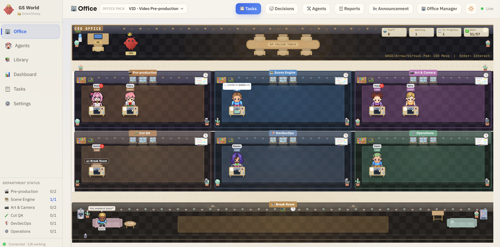
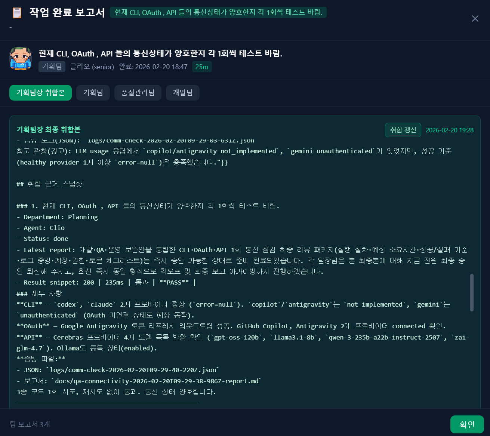
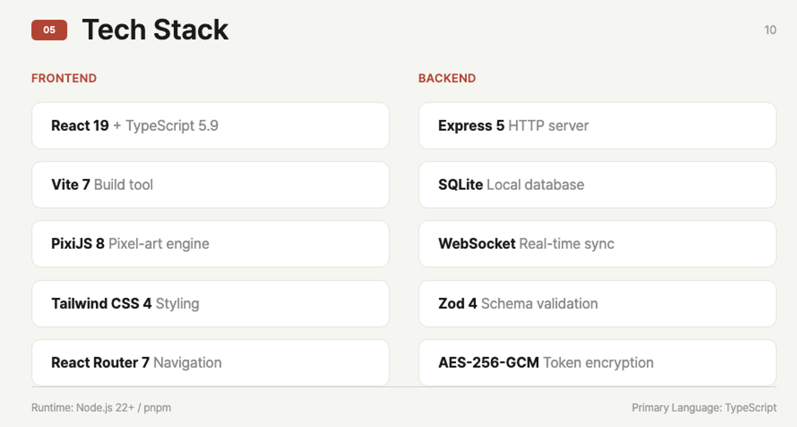
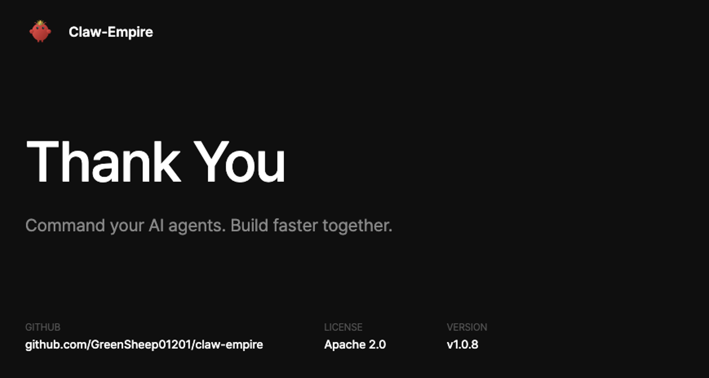

<p align="center">
  
</p>

<h1 align="center">Claw-Empire</h1>

<p align="center">
  <strong>Command Your AI Agent Empire from the CEO Desk</strong><br>
  A local-first AI agent office simulator that orchestrates <b>CLI</b>, <b>OAuth</b>, and <b>API-connected</b> providers (including <b>Claude Code</b>, <b>Codex CLI</b>, <b>Gemini CLI</b>, <b>OpenCode</b>, <b>GitHub Copilot</b>, and <b>Antigravity</b>) as a virtual company of autonomous agents.
</p>

<p align="center">
  
  <a href="https://github.com/GreenSheep01201/claw-empire/actions/workflows/ci.yml"></a>
  
  
  
  
</p>

<p align="center">
  <a href="#quick-start">Quick Start</a> &middot;
  <a href="#ai-installation-guide">AI Install Guide</a> &middot;
  <a href="docs/releases/v2.0.3.md">Release Notes</a> &middot;
  <a href="#openclaw-integration">OpenClaw</a> &middot;
  <a href="#direct-messenger-without-openclaw">Direct Messenger</a> &middot;
  <a href="#dollar-command-logic">$ Command</a> &middot;
  <a href="#features">Features</a> &middot;
  <a href="#screenshots">Screenshots</a> &middot;
  <a href="#tech-stack">Tech Stack</a> &middot;
  <a href="#cli-provider-setup">Providers</a> &middot;
  <a href="#security">Security</a>
</p>

<p align="center">
  <b>English</b> | <a href="README_ko.md">한국어</a> | <a href="README_jp.md">日本語</a> | <a href="README_zh.md">中文</a>
</p>

<p align="center">
  
</p>

---

## What is Claw-Empire?

Claw-Empire transforms your AI coding assistants — connected via **CLI**, **OAuth**, or **direct API keys** — into a fully simulated **virtual software company**. You are the CEO. Your AI agents are the employees. Watch them collaborate across departments, hold meetings, deliver tasks, and level up — all visualized through a charming pixel-art office interface.

### Why Claw-Empire?

- **One interface, many AI agents** — Manage CLI, OAuth, and API-backed agents from a single dashboard
- **Local-first & private** — All data stays on your machine. SQLite database, no cloud dependency
- **Visual & intuitive** — Pixel-art office view makes AI orchestration fun and transparent
- **Real autonomous collaboration** — Agents work in isolated git worktrees, attend meetings, and produce deliverables

---

## Install with AI

> **Just paste this to your AI coding agent (Claude Code, Codex, Gemini CLI, etc.):**
>
> ```
> Install Claw-Empire following the guide at:
> https://github.com/GreenSheep01201/claw-empire
> ```
>
> The AI will read this README and handle everything automatically.

---

## Latest Release (v2.0.3)

- **Final branch verification is now visible before merge** - the Diff Modal now shows a verification verdict, compare ref, commit count, changed files, and uncommitted-file state from `GET /api/tasks/:id/verify-commit`.
- **Completion reports retain merge-time verification evidence** - successful manual merge flow writes `Final branch verification: ...` logs, and the report popup surfaces them in the planning summary view.
- **Report avatars stay on sprite faces even when the active roster changes** - report rows and popups now reconstruct a fallback agent from report payload data instead of degrading to emoji when the current `agents` list no longer contains the assignee.
- **Selected salvage from PR #54 was added without importing its risky task-model changes** - this release includes the worktree verification API/UI, `scripts/cleanup-staff.mjs`, and optional `deploy/` self-host reference templates only.

- Full notes: [`docs/releases/v2.0.3.md`](docs/releases/v2.0.3.md)
- API docs: [`docs/api.md`](docs/api.md), [`docs/openapi.json`](docs/openapi.json)
- Security policy: [`SECURITY.md`](SECURITY.md)

## Office Pack Profiles (v2.0.1)

Each office pack applies a different collaboration topology, naming seed, and workflow bias.

| Pack | Core Focus | Representative Structure |
| --- | --- | --- |
| `development` (`DEV`) | Default engineering baseline with backward-compatible behavior | Planning / Development / Design / QA-QC / DevSecOps / Operations |
| `report` (`RPT`) | Structured report and document production | Editorial Planning, Research Engine, Doc Design, Review Desk |
| `web_research_report` (`WEB`) | Source collection and citation-first fact validation | Research Strategy, Crawler Team, Fact Check |
| `novel` (`NOV`) | Worldbuilding, narrative flow, and tone consistency | Worldbuilding, Narrative Engine, Character Art, Tone QA |
| `video_preprod` (`VID`) | Concept/script/shot-list/editing-note pre-production | Pre-production, Scene Engine, Art & Camera, Cut QA |
| `roleplay` (`RPG`) | In-character dialogue immersion and role consistency | Character Planning, Dialogue Engine, Stage Art, Character QA |

## Screenshots

<table>
<tr>
<td width="50%">

**Dashboard** — Real-time KPI metrics, agent rankings, and department status at a glance


</td>
<td width="50%">

**Kanban Board** — Drag-and-drop task management with department and agent filters


</td>
</tr>
<tr>
<td width="50%">

**Skills Library** — Browse and assign 600+ agent skills across categories


</td>
<td width="50%">

**Multi-Provider CLI** — Configure Claude Code, Codex, Gemini CLI, OpenCode with model selection


</td>
</tr>
<tr>
<td width="50%">

**OAuth Integration** — Secure GitHub & Google OAuth with encrypted token storage


</td>
<td width="50%">

**Meeting Minutes** — AI-generated meeting summaries with multi-round review approval


</td>
</tr>
<tr>
<td width="50%">

**Messenger Integration** — Configure Telegram, WhatsApp, Discord, Google Chat, Slack, Signal, iMessage sessions and send `$` CEO directives


</td>
<td width="50%">

**Settings** — Configure company name, CEO name, default provider preferences (CLI/OAuth/API), and language preferences


</td>
</tr>
<tr>
<td width="50%">

**Detailed Report** — Example of completion report popup, report history, and detailed report view for a request


</td>
<td width="50%">

**PPT Generation** — Example captures of PPT generation output for a report request

<p align="center">
  
  
</p>
</td>
</tr>
</table>

### Video Output Sample

Preview sample intro video output:

<p align="center">
  <video src="Sample_Img/claw-empire-intro.mp4" controls muted playsinline width="100%"></video>
</p>

- Direct file: [`Sample_Img/claw-empire-intro.mp4`](Sample_Img/claw-empire-intro.mp4)

### PPT Sample Sources

Use the sample sources below when reviewing or extending report-to-PPT generation:
Usage path: **Chat window > Report Request button**, then enter your request.

- Folder: [`docs/reports/Sample_Slides`](docs/reports/Sample_Slides)
- Sample deck (`.pptx`): [`docs/reports/PPT_Sample.pptx`](docs/reports/PPT_Sample.pptx)
- HTML slides: [`slide-01.html`](docs/reports/Sample_Slides/slide-01.html), [`slide-02.html`](docs/reports/Sample_Slides/slide-02.html), [`slide-03.html`](docs/reports/Sample_Slides/slide-03.html), [`slide-04.html`](docs/reports/Sample_Slides/slide-04.html), [`slide-05.html`](docs/reports/Sample_Slides/slide-05.html), [`slide-06.html`](docs/reports/Sample_Slides/slide-06.html), [`slide-07.html`](docs/reports/Sample_Slides/slide-07.html), [`slide-08.html`](docs/reports/Sample_Slides/slide-08.html), [`slide-09.html`](docs/reports/Sample_Slides/slide-09.html)
- Build scripts: [`build-pptx.mjs`](docs/reports/Sample_Slides/build-pptx.mjs), [`build-pptx.cjs`](docs/reports/Sample_Slides/build-pptx.cjs), [`html2pptx.cjs`](docs/reports/Sample_Slides/html2pptx.cjs)

---

## Features

| Feature                        | Description                                                                                                                                                  |
| ------------------------------ | ------------------------------------------------------------------------------------------------------------------------------------------------------------ |
| **Pixel-Art Office**           | Animated office view with agents walking, working, and attending meetings across 6 departments                                                               |
| **Workflow Pack Profiles**     | Six built-in workflow packs (`development`, `report`, `web_research_report`, `novel`, `video_preprod`, `roleplay`) provide pack-specific routing schema, QA rules, and output templates |
| **Office Pack Profiles**       | Pack-scoped office profiles apply dedicated department topology, naming/theme presets, and isolated agent/department data per pack (except DB-backed development baseline) |
| **Kanban Task Board**          | Full task lifecycle — Inbox, Planned, Collaborating, In Progress, Review, Done — with drag-and-drop                                                          |
| **CEO Chat & Directives**      | Direct communication with team leaders; `$` directives support meeting choice plus project path/context routing (`project_path`, `project_context`)          |
| **Multi-Provider Support**     | Claude Code, Codex CLI, Gemini CLI, OpenCode, Antigravity — all from one dashboard                                                                           |
| **External API Providers**     | Connect agents to external LLM APIs (OpenAI, Anthropic, Google, Ollama, OpenRouter, Together, Groq, Cerebras, custom) via Settings > API tab                 |
| **OAuth Integration**          | GitHub & Google OAuth with AES-encrypted token storage in local SQLite                                                                                       |
| **Real-time WebSocket**        | Live status updates, activity feed, and agent state synchronization                                                                                          |
| **Active Agent Control**       | Active-agent monitor with process/activity/idle metadata and direct kill action for stuck tasks                                                              |
| **Task Report System**         | Completion popup, report history, team report drilldown, and planning-lead consolidated archive                                                              |
| **Agent Management**           | Hire, edit, and delete agents with multilingual names, role/department/provider selection, and personality fields                                            |
| **Agent Ranking & XP**         | Agents earn XP for completed tasks; ranking board tracks top performers                                                                                      |
| **Skills Library**             | 600+ categorized skills (Frontend, Backend, Design, AI, DevOps, Security, etc.) with custom skill upload support                                             |
| **Meeting System**             | Planned and ad-hoc meetings with AI-generated minutes and multi-round review                                                                                 |
| **Git Worktree Isolation**     | Each agent works in isolated git branches, merged only on CEO approval                                                                                       |
| **Multi-Language UI**          | English, Korean, Japanese, Chinese — auto-detected or manually set                                                                                           |
| **Messenger Integration**      | Telegram, Discord, Slack and more — send `$` CEO directives and receive updates through built-in direct channel sessions (OpenClaw optional)                 |
| **PowerPoint Export**          | Generate presentation slides from meeting minutes and reports                                                                                                |
| **Connectivity QA Scripts**    | Built-in `test:comm:*` scripts for CLI/OAuth/API communication validation with retry and evidence logs                                                       |
| **In-App Update Notice**       | Checks GitHub latest release and shows a top banner with OS-specific `git pull` guidance when a newer version is available                                   |
| **Department Management**      | Planning, Development, Design, QA/QC, DevSecOps, Operations — with dedicated management tab for arrow/drag-and-drop sort order editing                       |
| **Manual Agent Assignment**    | Assign specific agents to projects; meetings/delegation respect manual selection, with pre-save safeguards for no-agent or leader-only selections            |
| **Sprite Registration Safety** | Prevents duplicate sprite-number file overwrite by rejecting conflicting uploads with explicit `409 sprite_number_exists` responses                          |
| **Custom Skill Upload**        | Upload `.md` skill files through the UI to train CLI representatives with custom skills, complete with classroom training animation and management interface |

---

## Tech Stack

| Layer                | Technology                                          |
| -------------------- | --------------------------------------------------- |
| **Frontend**         | React 19 + Vite 7 + Tailwind CSS 4 + TypeScript 5.9 |
| **Pixel Art Engine** | PixiJS 8                                            |
| **Backend**          | Express 5 + SQLite (zero-config embedded DB)        |
| **Real-time**        | WebSocket (ws)                                      |
| **Validation**       | Zod 4                                               |
| **Icons**            | Lucide React                                        |
| **Routing**          | React Router 7                                      |
| **Export**           | PptxGenJS (PowerPoint generation)                   |

<a id="ai-installation-guide">
## AI Installation Guide

> This section is for AI coding agents. Execute each step and run verification commands before moving to the next step.

### Step 0: Verify prerequisites

```bash
# Node.js 22+
node -v

# pnpm (or enable corepack)
pnpm -v || corepack enable

# git
git --version
```

### Step 1: Clone and run one-click setup

```bash
git clone https://github.com/GreenSheep01201/claw-empire.git
cd claw-empire
git submodule update --init --recursive
bash install.sh
```

Windows PowerShell:

```powershell
git clone https://github.com/GreenSheep01201/claw-empire.git
cd claw-empire
git submodule update --init --recursive
powershell -ExecutionPolicy Bypass -File .\install.ps1
```

### Step 2: Verify setup output

macOS/Linux:

```bash
# Required files after setup
[ -f .env ] && [ -f scripts/setup.mjs ] && echo "setup files ok"

# AGENTS orchestration rules installed
grep -R "BEGIN claw-empire orchestration rules" ~/.openclaw/workspace/AGENTS.md AGENTS.md 2>/dev/null || true
grep -R "INBOX_SECRET_DISCOVERY_V2" ~/.openclaw/workspace/AGENTS.md AGENTS.md 2>/dev/null || true

# OpenClaw inbox requirements in .env
grep -E '^(INBOX_WEBHOOK_SECRET|OPENCLAW_CONFIG)=' .env || true
```

Windows PowerShell:

```powershell
if ((Test-Path .\.env) -and (Test-Path .\scripts\setup.mjs)) { "setup files ok" }
$agentCandidates = @("$env:USERPROFILE\.openclaw\workspace\AGENTS.md", ".\AGENTS.md")
$agentCandidates | ForEach-Object { if (Test-Path $_) { Select-String -Path $_ -Pattern "BEGIN claw-empire orchestration rules" } }
$agentCandidates | ForEach-Object { if (Test-Path $_) { Select-String -Path $_ -Pattern "INBOX_SECRET_DISCOVERY_V2" } }

# OpenClaw inbox requirements in .env
Get-Content .\.env | Select-String -Pattern '^(INBOX_WEBHOOK_SECRET|OPENCLAW_CONFIG)='
```

### Step 3: Start and health-check

```bash
pnpm dev:local
```

In another terminal:

```bash
curl -s http://127.0.0.1:8790/healthz
```

Expected: `{"ok":true,...}`

Messenger channels are configured in Settings UI and persisted to SQLite (`settings.messengerChannels`). `.env` messenger token/channel variables are no longer used.

### Step 4: Optional messenger + inbox verification

```bash
curl -s http://127.0.0.1:8790/api/messenger/sessions
```

This returns messenger sessions saved in Settings.

```bash
curl -X POST http://127.0.0.1:8790/api/inbox \
  -H "content-type: application/json" \
  -H "x-inbox-secret: $INBOX_WEBHOOK_SECRET" \
  -d '{"source":"telegram","author":"ceo","text":"$README v1.1.6 inbox smoke test","skipPlannedMeeting":true}'
```

Expected:

- `200` when `INBOX_WEBHOOK_SECRET` is configured and `x-inbox-secret` matches.
- `401` when the header is missing/mismatched.
- `503` when `INBOX_WEBHOOK_SECRET` is not configured on the server.

<a id="direct-messenger-without-openclaw"></a>

### Step 5: Direct messenger setup (no OpenClaw required)

You can run messenger channels directly from Claw-Empire without OpenClaw.

1. Open `Settings > Channel Messages`.
2. Click `Add Chat`.
3. Select a messenger (`telegram`, `whatsapp`, `discord`, `googlechat`, `slack`, `signal`, `imessage`).
4. Fill in session fields:
   - `Name` (session label)
   - messenger token/credential
   - `Channel/Chat ID` (target)
   - mapped conversation `Agent`
5. Click `Confirm` to save immediately (no extra global save step required).
6. Enable the session, then test:
   - normal message -> direct agent chat
   - `$ ...` -> directive flow

Notes:

- Messenger sessions are persisted in SQLite (`settings.messengerChannels`).
- Messenger tokens are encrypted at rest (AES-256-GCM) using `OAUTH_ENCRYPTION_SECRET` (fallback: `SESSION_SECRET`) and decrypted only at runtime.
- `.env` messenger variables (`TELEGRAM_BOT_TOKEN`, `DISCORD_BOT_TOKEN`, `SLACK_BOT_TOKEN`, etc.) are not used.
- `/api/inbox` + `INBOX_WEBHOOK_SECRET` is only needed for webhook/inbox flows (including OpenClaw bridge).

---

## Quick Start

### Prerequisites

| Tool        | Version | Install                                |
| ----------- | ------- | -------------------------------------- |
| **Node.js** | >= 22   | [nodejs.org](https://nodejs.org/)      |
| **pnpm**    | latest  | `corepack enable` (built into Node.js) |
| **Git**     | any     | [git-scm.com](https://git-scm.com/)    |

### One-Click Setup (Recommended)

| Platform                 | Command                                                                                                                                |
| ------------------------ | -------------------------------------------------------------------------------------------------------------------------------------- |
| **macOS / Linux**        | `git clone https://github.com/GreenSheep01201/claw-empire.git && cd claw-empire && bash install.sh`                                    |
| **Windows (PowerShell)** | `git clone https://github.com/GreenSheep01201/claw-empire.git; cd claw-empire; powershell -ExecutionPolicy Bypass -File .\install.ps1` |

If the repo is already cloned:

| Platform                 | Command                                                                                                          |
| ------------------------ | ---------------------------------------------------------------------------------------------------------------- |
| **macOS / Linux**        | `git submodule update --init --recursive && bash scripts/openclaw-setup.sh`                                      |
| **Windows (PowerShell)** | `git submodule update --init --recursive; powershell -ExecutionPolicy Bypass -File .\scripts\openclaw-setup.ps1` |

### OpenClaw `.env` Requirements (for `/api/inbox`)

Set both values in `.env` before sending chat webhooks:

- `INBOX_WEBHOOK_SECRET=<long-random-secret>`
- `OPENCLAW_CONFIG=<absolute-path-to-openclaw.json>` (unquoted preferred)

`scripts/openclaw-setup.sh` / `scripts/openclaw-setup.ps1` now auto-generate `INBOX_WEBHOOK_SECRET` when it is missing.
Initial install via `bash install.sh` / `install.ps1` already goes through these setup scripts, so this is applied from day one.
For existing clones that only run `git pull`, `pnpm dev*` / `pnpm start*` now auto-apply this once when needed and then persist `CLAW_MIGRATION_V1_0_5_DONE=1` to prevent repeated execution.

`/api/inbox` requires server-side `INBOX_WEBHOOK_SECRET` plus an `x-inbox-secret` header that exactly matches it.

- Missing/mismatched header -> `401`
- Missing server config (`INBOX_WEBHOOK_SECRET`) -> `503`

### Manual Setup (Fallback)

<details>
<summary><b>macOS / Linux</b></summary>

```bash
# 1. Clone the repository
git clone https://github.com/GreenSheep01201/claw-empire.git
cd claw-empire

# 2. Enable pnpm via corepack
corepack enable

# 3. Install dependencies
pnpm install

# 4. Create your local environment file
cp .env.example .env

# 5. Generate a random encryption secret
node -e "
  const fs = require('fs');
  const crypto = require('crypto');
  const p = '.env';
  const content = fs.readFileSync(p, 'utf8');
  fs.writeFileSync(p, content.replace('__CHANGE_ME__', crypto.randomBytes(32).toString('hex')));
"

# 6. Setup AGENTS.md orchestration rules (teaches your AI agent to be a Claw-Empire project manager)
pnpm setup -- --port 8790

# 7. Start the development server
pnpm dev:local
```

</details>

<details>
<summary><b>Windows (PowerShell)</b></summary>

```powershell
# 1. Clone the repository
git clone https://github.com/GreenSheep01201/claw-empire.git
cd claw-empire

# 2. Enable pnpm via corepack
corepack enable

# 3. Install dependencies
pnpm install

# 4. Create your local environment file
Copy-Item .env.example .env

# 5. Generate a random encryption secret
node -e "const fs=require('fs');const crypto=require('crypto');const p='.env';const c=fs.readFileSync(p,'utf8');fs.writeFileSync(p,c.replace('__CHANGE_ME__',crypto.randomBytes(32).toString('hex')))"

# 6. Setup AGENTS.md orchestration rules (teaches your AI agent to be a Claw-Empire project manager)
pnpm setup -- --port 8790

# 7. Start the development server
pnpm dev:local
```

</details>

Open your browser:

| URL                             | Description                |
| ------------------------------- | -------------------------- |
| `http://127.0.0.1:8800`         | Frontend (Vite dev server) |
| `http://127.0.0.1:8790/healthz` | API health check           |

### AGENTS.md Setup

The `pnpm setup` command injects **CEO directive orchestration rules** into your AI agent's `AGENTS.md` file. This teaches your AI coding agent (Claude Code, Codex, etc.) how to:

- Interpret `$` prefix **CEO directives** for priority task delegation
- Call the Claw-Empire REST API to create tasks, assign agents, and report status
- Work within isolated git worktrees for safe parallel development

```bash
# Default: auto-detects AGENTS.md location
pnpm setup

# Custom path
pnpm setup -- --agents-path /path/to/your/AGENTS.md

# Custom port
pnpm setup -- --port 8790
```

<a id="openclaw-integration"></a>

### OpenClaw Integration Setup (Telegram/WhatsApp/Discord/Google Chat/Slack/Signal/iMessage)

`install.sh` / `install.ps1` (or `scripts/openclaw-setup.*`) will auto-detect and write `OPENCLAW_CONFIG` when possible.

Recommended `.env` format: absolute path for `OPENCLAW_CONFIG` (unquoted preferred).
`v1.0.5` also normalizes surrounding quotes and leading `~` at runtime for compatibility.

Default config paths:

| OS                | Path                                    |
| ----------------- | --------------------------------------- |
| **macOS / Linux** | `~/.openclaw/openclaw.json`             |
| **Windows**       | `%USERPROFILE%\.openclaw\openclaw.json` |

Manual commands:

```bash
# macOS / Linux
bash scripts/openclaw-setup.sh --openclaw-config ~/.openclaw/openclaw.json
```

```powershell
# Windows PowerShell
powershell -ExecutionPolicy Bypass -File .\scripts\openclaw-setup.ps1 -OpenClawConfig "$env:USERPROFILE\.openclaw\openclaw.json"
```

Verify messenger sessions:

```bash
curl -s http://127.0.0.1:8790/api/gateway/targets
```

<a id="dollar-command-logic"></a>

### `$` Command -> OpenClaw Chat Delegation Logic

When a chat message starts with `$`, Claw-Empire handles it as a CEO directive:

1. Orchestrator asks whether to hold a team-leader meeting first.
2. Orchestrator asks for project path/context (`project_path` or `project_context`).
3. It sends the directive to `POST /api/inbox` with the `$` prefix and `x-inbox-secret` header.
4. If meeting is skipped, include `"skipPlannedMeeting": true`.
5. Server stores it as `directive`, broadcasts company-wide, then delegates to Planning (and mentioned departments when included).

If `x-inbox-secret` is missing/mismatched, the request is rejected with `401`.
If `INBOX_WEBHOOK_SECRET` is not configured on the server, the request is rejected with `503`.

With meeting:

```bash
curl -X POST http://127.0.0.1:8790/api/inbox \
  -H "content-type: application/json" \
  -H "x-inbox-secret: $INBOX_WEBHOOK_SECRET" \
  -d '{"source":"telegram","author":"ceo","text":"$Release v0.2 by Friday with QA sign-off","project_path":"/workspace/my-project"}'
```

Without meeting:

```bash
curl -X POST http://127.0.0.1:8790/api/inbox \
  -H "content-type: application/json" \
  -H "x-inbox-secret: $INBOX_WEBHOOK_SECRET" \
  -d '{"source":"telegram","author":"ceo","text":"$Hotfix production login bug immediately","skipPlannedMeeting":true,"project_context":"existing climpire project"}'
```

---

## Environment Variables

Copy `.env.example` to `.env`. All secrets stay local — never commit `.env`.

| Variable                               | Required                 | Description                                                                                                                                  |
| -------------------------------------- | ------------------------ | -------------------------------------------------------------------------------------------------------------------------------------------- |
| `OAUTH_ENCRYPTION_SECRET`              | **Yes**                  | Encrypts OAuth tokens and messenger channel tokens in SQLite (AES-256-GCM)                                                                   |
| `SESSION_SECRET`                       | Fallback                 | Legacy fallback key used only when `OAUTH_ENCRYPTION_SECRET` is not set                                                                      |
| `PORT`                                 | No                       | Server port (default: `8790`)                                                                                                                |
| `HOST`                                 | No                       | Bind address (default: `127.0.0.1`)                                                                                                          |
| `API_AUTH_TOKEN`                       | Recommended              | Bearer token for non-loopback API/WebSocket access                                                                                           |
| `INBOX_WEBHOOK_SECRET`                 | **Yes for `/api/inbox`** | Shared secret required in `x-inbox-secret` header                                                                                            |
| `OPENCLAW_CONFIG`                      | Recommended for OpenClaw | Absolute path to `openclaw.json` used for gateway target discovery/chat relay                                                                |
| `DB_PATH`                              | No                       | SQLite database path (default: `./claw-empire.sqlite`)                                                                                       |
| `LOGS_DIR`                             | No                       | Log directory (default: `./logs`)                                                                                                            |
| `OAUTH_GITHUB_CLIENT_ID`               | No                       | GitHub OAuth App client ID                                                                                                                   |
| `OAUTH_GITHUB_CLIENT_SECRET`           | No                       | GitHub OAuth App client secret                                                                                                               |
| `OAUTH_GOOGLE_CLIENT_ID`               | No                       | Google OAuth client ID                                                                                                                       |
| `OAUTH_GOOGLE_CLIENT_SECRET`           | No                       | Google OAuth client secret                                                                                                                   |
| `OPENAI_API_KEY`                       | No                       | OpenAI API key (for Codex)                                                                                                                   |
| `REVIEW_MEETING_ONESHOT_TIMEOUT_MS`    | No                       | One-shot meeting timeout in milliseconds (default `65000`; backward-compatible: values `<= 600` are treated as seconds)                      |
| `UPDATE_CHECK_ENABLED`                 | No                       | Enable in-app update check banner (`1` default, set `0` to disable)                                                                          |
| `UPDATE_CHECK_REPO`                    | No                       | GitHub repo slug used for update checks (default: `GreenSheep01201/claw-empire`)                                                             |
| `UPDATE_CHECK_TTL_MS`                  | No                       | Update-check cache TTL in milliseconds (default: `1800000`)                                                                                  |
| `UPDATE_CHECK_TIMEOUT_MS`              | No                       | GitHub request timeout in milliseconds (default: `4000`)                                                                                     |
| `AUTO_UPDATE_ENABLED`                  | No                       | Default auto-update value when `settings.autoUpdateEnabled` is missing (`0` default)                                                         |
| `AUTO_UPDATE_CHANNEL`                  | No                       | Allowed update channel: `patch` (default), `minor`, `all`                                                                                    |
| `AUTO_UPDATE_IDLE_ONLY`                | No                       | Apply only when no `in_progress` tasks/active CLI processes (`1` default)                                                                    |
| `AUTO_UPDATE_CHECK_INTERVAL_MS`        | No                       | Auto-update check interval in milliseconds (default follows `UPDATE_CHECK_TTL_MS`)                                                           |
| `AUTO_UPDATE_INITIAL_DELAY_MS`         | No                       | Delay before first auto-update check after startup (default `60000`, min `60000`)                                                            |
| `AUTO_UPDATE_TARGET_BRANCH`            | No                       | Branch name used for branch guard and `git fetch/pull` target (default `main`)                                                               |
| `AUTO_UPDATE_GIT_FETCH_TIMEOUT_MS`     | No                       | Timeout for `git fetch` during update apply (default `120000`)                                                                               |
| `AUTO_UPDATE_GIT_PULL_TIMEOUT_MS`      | No                       | Timeout for `git pull --ff-only` during update apply (default `180000`)                                                                      |
| `AUTO_UPDATE_INSTALL_TIMEOUT_MS`       | No                       | Timeout for `pnpm install --frozen-lockfile` during update apply (default `300000`)                                                          |
| `AUTO_UPDATE_COMMAND_OUTPUT_MAX_CHARS` | No                       | Max in-memory capture size per stdout/stderr stream before tail-trimming (default `200000`)                                                  |
| `AUTO_UPDATE_TOTAL_TIMEOUT_MS`         | No                       | Global timeout cap for one apply run (default `900000`)                                                                                      |
| `AUTO_UPDATE_RESTART_MODE`             | No                       | Restart policy after auto-apply: `notify` (default), `exit`, `command`                                                                       |
| `AUTO_UPDATE_EXIT_DELAY_MS`            | No                       | Delay before process exit in `exit` mode (default `10000`, min `1200`)                                                                       |
| `AUTO_UPDATE_RESTART_COMMAND`          | No                       | Executable + args used when restart mode is `command` (shell metacharacters + direct shell launchers rejected; runs with server permissions) |

When `API_AUTH_TOKEN` is enabled, remote browser clients enter it at runtime. The token is stored only in `sessionStorage` and is not embedded in Vite build artifacts.
For `OPENCLAW_CONFIG`, absolute path is recommended. In `v1.0.5`, quoted values and leading `~` are normalized automatically.

---

## Run Modes

```bash
# Development (local-only, recommended)
pnpm dev:local          # binds to 127.0.0.1

# Development (network-accessible)
pnpm dev                # binds to 0.0.0.0

# Production build
pnpm build              # TypeScript check + Vite build
pnpm start              # start API/backend server (serves dist in production mode)

# Health check
curl -fsS http://127.0.0.1:8790/healthz
```

### CI Verification (Current PR Pipeline)

On every pull request, `.github/workflows/ci.yml` runs:

1. Hidden/bidi Unicode guard for workflow files
2. `pnpm install --frozen-lockfile`
3. `pnpm run format:check`
4. `pnpm run lint`
5. `pnpm exec playwright install --with-deps`
6. `pnpm run test:ci` (`test:web --coverage` + `test:api --coverage` + `test:e2e`)

Recommended local pre-PR check:

```bash
pnpm run format:check
pnpm run lint
pnpm run build
pnpm run test:ci
```

### Communication QA Checks (v1.1.6)

```bash
# Individual checks
pnpm run test:comm:llm
pnpm run test:comm:oauth
pnpm run test:comm:api

# Integrated suite (also available via legacy entrypoint)
pnpm run test:comm:suite
pnpm run test:comm-status
```

`test:comm:suite` writes machine-readable evidence to `logs/` and a markdown report to `docs/`.

### Project Path QA Smoke (v1.1.6)

```bash
# Requires API auth token
QA_API_AUTH_TOKEN="<API_AUTH_TOKEN>" pnpm run test:qa:project-path
```

`test:qa:project-path` validates path helper endpoints, project create flow, duplicate `project_path` conflict response, and cleanup behavior.

### In-App Update Banner

When a newer release is published on GitHub, Claw-Empire shows a top banner in the UI with pull instructions and a release-note link.

- Windows PowerShell: `git pull; pnpm install`
- macOS/Linux shell: `git pull && pnpm install`
- After pull/install, restart the server.

### Auto Update (Safe Mode, opt-in)

You can enable conservative auto-update behavior for release sync.

- `GET /api/update-auto-status` — current auto-update runtime/config state (**auth required**)
- `POST /api/update-auto-config` — update runtime auto-update toggle (`enabled`) without restart (**auth required**)
- `POST /api/update-apply` — apply update pipeline on demand (`dry_run` / `force` / `force_confirm` supported, **auth required**)
  - `force=true` bypasses most safety guards and therefore requires `force_confirm=true`
  - `dirty_worktree` and `channel_check_unavailable` guards are non-overridable (still block apply)
  - Restart mode (`notify|exit|command`) is applied for both auto and manual update runs
  - In `notify` mode, successful apply includes `manual_restart_required` reason

Default behavior remains unchanged (**OFF**). When enabled, safe-mode guards skip updates if the server is busy or the repository is not in a clean fast-forward state.
If `AUTO_UPDATE_CHANNEL` has an invalid value, the server logs a warning and falls back to `patch`.

#### Troubleshooting: `git_pull_failed` / diverged local branch

If an apply result returns `error: "git_pull_failed"` (or `git_fetch_failed`) with `manual_recovery_may_be_required` in `result.reasons`, the repository likely needs operator intervention.

1. Inspect the latest apply result via `GET /api/update-auto-status` (`runtime.last_result`, `runtime.last_error`).
2. In the server repo, check divergence:
   - `git fetch origin main`
   - `git status`
   - `git log --oneline --decorate --graph --max-count 20 --all`
3. Resolve to a clean fast-forwardable state (for example, rebase local commits or reset to `origin/main` based on your policy).
4. Re-run `POST /api/update-apply` (optionally `{"dry_run": true}` first).

The auto-update loop keeps running on its configured interval and will retry on future cycles after the repository returns to a safe state.

⚠️ `AUTO_UPDATE_RESTART_COMMAND` runs with server permissions and is a privileged operation.
The command parser rejects shell metacharacters (`;`, `|`, `&`, `` ` ``, `$`, `<`, `>`) and blocks direct shell launchers (for example `sh`, `bash`, `zsh`, `cmd`, `powershell`, `pwsh`).
Use only a plain executable + fixed args format (no shell/interpreter wrappers, no dynamically constructed input).

---

<a id="cli-provider-setup"></a>

## Provider Setup (CLI / OAuth / API)

Claw-Empire supports three provider paths:

- **CLI tools** — install local coding CLIs and run tasks through local processes
- **OAuth accounts** — connect supported providers (for example GitHub/Google-backed flows) via secure token exchange
- **Direct API keys** — bind agents to external LLM APIs from **Settings > API**

For CLI mode, install at least one:

| Provider                                                      | Install                              | Auth                           |
| ------------------------------------------------------------- | ------------------------------------ | ------------------------------ |
| [Claude Code](https://docs.anthropic.com/en/docs/claude-code) | `npm i -g @anthropic-ai/claude-code` | `claude` (follow prompts)      |
| [Codex CLI](https://github.com/openai/codex)                  | `npm i -g @openai/codex`             | Set `OPENAI_API_KEY` in `.env` |
| [Gemini CLI](https://github.com/google-gemini/gemini-cli)     | `npm i -g @google/gemini-cli`        | OAuth via Settings panel       |
| [OpenCode](https://github.com/opencode-ai/opencode)           | `npm i -g opencode`                  | Provider-specific              |

Configure providers and models in the **Settings > CLI Tools** panel within the app.

Alternatively, connect agents to external LLM APIs (no CLI installation required) via the **Settings > API** tab. API keys are stored encrypted (AES-256-GCM) in the local SQLite database — not in `.env` or source code.
Skills learn/unlearn automation is currently designed for CLI-capable providers.

---

## Project Structure

```
claw-empire/
├── .github/
│   └── workflows/
│       └── ci.yml             # PR CI (Unicode guard, format, lint, tests)
├── server/
│   ├── index.ts              # backend entrypoint
│   ├── server-main.ts        # runtime wiring/bootstrap
│   ├── modules/              # routes/workflow/bootstrap lifecycle
│   ├── test/                 # backend test setup/helpers
│   └── vitest.config.ts      # backend unit test config
├── src/
│   ├── app/                  # app shell, layout, state orchestration
│   ├── api/                  # frontend API modules
│   ├── components/           # UI (office/taskboard/chat/settings)
│   ├── hooks/                # polling/websocket hooks
│   ├── test/                 # frontend test setup
│   ├── types/                # frontend type definitions
│   ├── App.tsx
│   ├── api.ts
│   └── i18n.ts
├── tests/
│   └── e2e/                  # Playwright E2E scenarios
├── public/sprites/           # pixel-art agent sprites
├── scripts/
│   ├── setup.mjs             # environment/bootstrap setup
│   ├── auto-apply-v1.0.5.mjs # startup migration helper
│   ├── openclaw-setup.sh     # one-click setup (macOS/Linux)
│   ├── openclaw-setup.ps1    # one-click setup (Windows PowerShell)
│   ├── prepare-e2e-runtime.mjs
│   ├── preflight-public.sh   # pre-release security checks
│   └── generate-architecture-report.mjs
├── install.sh                # wrapper for scripts/openclaw-setup.sh
├── install.ps1               # wrapper for scripts/openclaw-setup.ps1
├── docs/                     # design & architecture docs
├── AGENTS.md                 # local agent/orchestration rules
├── CONTRIBUTING.md           # branch/PR/review policy
├── eslint.config.mjs         # flat ESLint config
├── .env.example              # environment variable template
└── package.json
```

---

## Security

Claw-Empire is designed with security in mind:

- **Local-first architecture** — All data stored locally in SQLite; no external cloud services required
- **Encrypted OAuth + messenger tokens** — User-specific OAuth tokens and direct messenger channel tokens are stored **server-side only** in SQLite, encrypted at rest using AES-256-GCM with `OAUTH_ENCRYPTION_SECRET` (`SESSION_SECRET` fallback). The browser never receives refresh tokens
- **Built-in OAuth Client IDs** — The GitHub and Google OAuth client IDs/secrets embedded in the source code are **public OAuth app credentials**, not user secrets. Per [Google's documentation](https://developers.google.com/identity/protocols/oauth2/native-app), client secrets for installed/desktop apps are "not treated as a secret." This is standard practice for open-source apps (VS Code, Thunderbird, GitHub CLI, etc.). These credentials only identify the app itself — your personal tokens are always encrypted separately
- **No personal credentials in source** — All user-specific tokens (GitHub, Google OAuth) are stored encrypted in the local SQLite database, never in source code
- **No secrets in repo** — Comprehensive `.gitignore` blocks `.env`, `*.pem`, `*.key`, `credentials.json`, etc.
- **Preflight security checks** — Run `pnpm run preflight:public` before any public release to scan for leaked secrets in both working tree and git history
- **Localhost by default** — Development server binds to `127.0.0.1`, not exposed to network

## API Docs & Security Quick Links

- **API documentation** — Use [`docs/api.md`](docs/api.md) for endpoint overview and usage notes, and [`docs/openapi.json`](docs/openapi.json) for schema/tooling integration.
- **Security policy** — Review disclosure and policy details in [`SECURITY.md`](SECURITY.md), and run `pnpm run preflight:public` before public releases.

---

## Contributing

Contributions are welcome! Please:

1. Fork the repository
2. Create a feature branch from `dev` (`git checkout -b feature/amazing-feature`)
3. Commit your changes (`git commit -m 'Add amazing feature'`)
4. Run local checks before PR:
   - `pnpm run format:check`
   - `pnpm run lint`
   - `pnpm run build`
   - `pnpm run test:ci`
5. Push your branch (`git push origin feature/amazing-feature`)
6. Open a Pull Request to `dev` (default integration branch for contributors)
7. Use `main` only for maintainer-approved emergency hotfixes, then back-merge `main -> dev`

Full policy: [`CONTRIBUTING.md`](CONTRIBUTING.md)

---

## License

[Apache 2.0](LICENSE) — Free for personal and commercial use.

---

<div align="center">

**Built with pixels and passion.**

_Claw-Empire — Where AI agents come to work._

</div>
