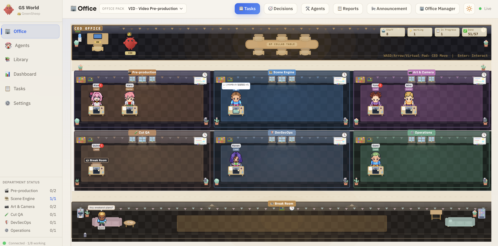
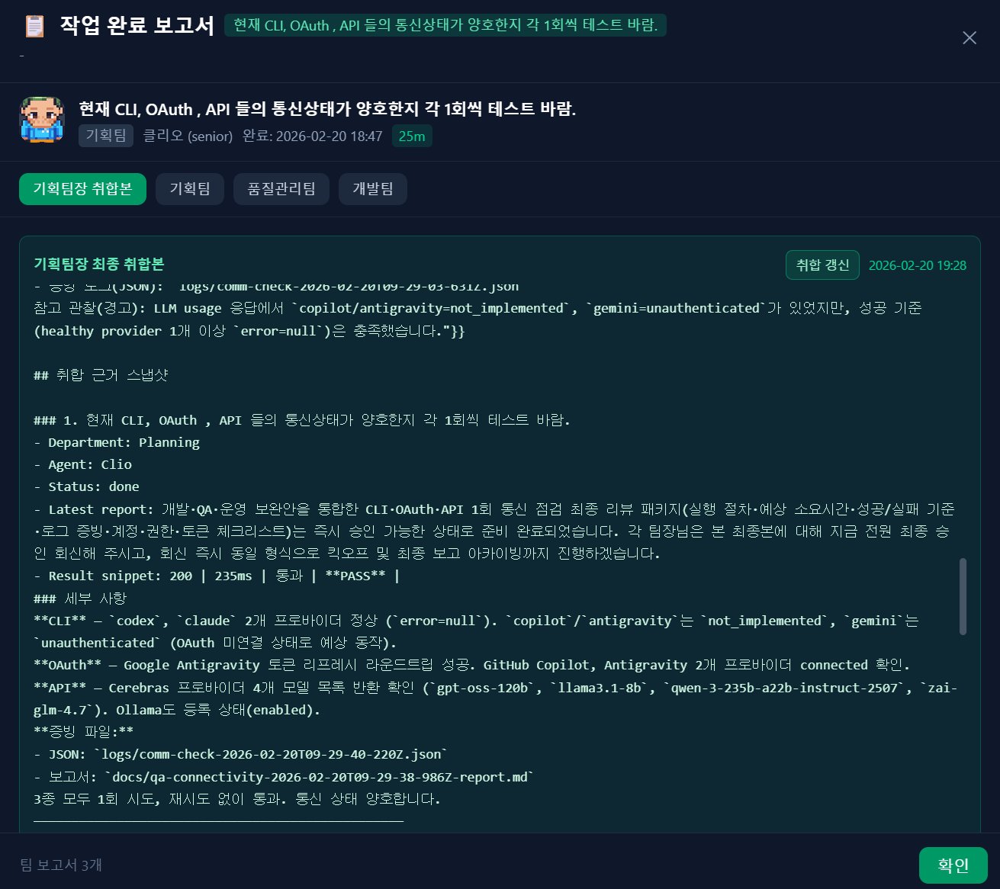
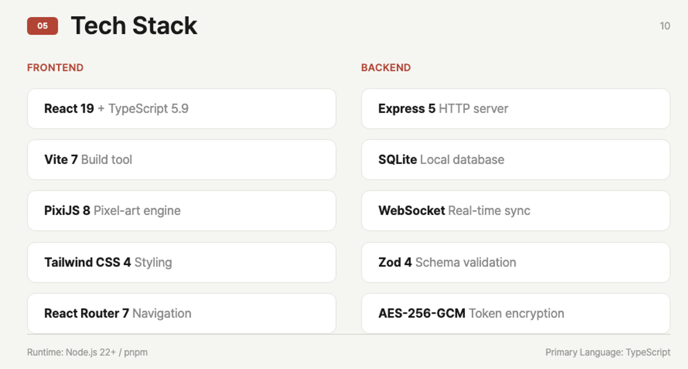
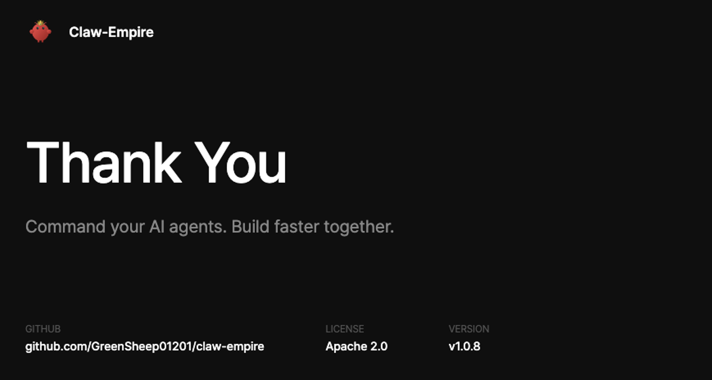

<p align="center">
  
</p>

<h1 align="center">Claw-Empire</h1>

<p align="center">
  <strong>从CEO办公桌指挥您的AI代理帝国</strong><br>
  一个本地优先的 AI 代理办公室模拟器，可将 <b>CLI</b>、<b>OAuth</b>、<b>API 连接</b> 的提供商（如 <b>Claude Code</b>、<b>Codex CLI</b>、<b>Gemini CLI</b>、<b>OpenCode</b>、<b>GitHub Copilot</b>、<b>Antigravity</b>）统一编排为自治虚拟公司
</p>

<p align="center">
  
  
  
  
  
</p>

<p align="center">
  <a href="#快速开始">快速开始</a> &middot;
  <a href="#ai-installation-guide">AI 安装指南</a> &middot;
  <a href="docs/releases/v1.1.5.md">发布说明</a> &middot;
  <a href="#openclaw-integration">OpenClaw 集成</a> &middot;
  <a href="#dollar-command-logic">$ 命令逻辑</a> &middot;
  <a href="#功能特性">功能特性</a> &middot;
  <a href="#截图">截图</a> &middot;
  <a href="#技术栈">技术栈</a> &middot;
  <a href="#cli-提供商配置">提供商</a> &middot;
  <a href="#安全性">安全性</a>
</p>

<p align="center">
  <a href="README.md">English</a> | <a href="README_ko.md">한국어</a> | <a href="README_jp.md">日本語</a> | <b>中文</b>
</p>

<p align="center">
  
</p>

---

## 什么是 Claw-Empire？

Claw-Empire 将通过 **CLI**、**OAuth** 或 **直接 API Key** 连接的 AI 编程助手，转化为一个完整模拟的**虚拟软件公司**。您是 CEO，AI 代理是员工。看着它们跨部门协作、召开会议、完成任务、不断成长 —— 一切都通过迷人的像素风格办公室界面直观呈现。

### 为什么选择 Claw-Empire？

- **统一界面，多款 AI 代理** — 在单一仪表板管理 CLI/OAuth/API 接入的代理
- **本地优先，隐私保障** — 所有数据存储在您的机器上，SQLite 数据库，无需云端依赖
- **可视化且直观** — 像素艺术风格的办公室视图，让 AI 编排变得有趣而透明
- **真正的自主协作** — 代理在独立的 git worktree 中工作、参加会议并产出成果

---

## 用 AI 安装

> **只需将以下内容粘贴到您的 AI 编程代理（Claude Code、Codex、Gemini CLI 等）：**
>
> ```
> Install Claw-Empire following the guide at:
> https://github.com/GreenSheep01201/claw-empire
> ```
>
> AI 将阅读此 README 并自动处理一切。

---

## 最新发布 (v1.1.5)

- **项目名称输入优先流程** — `+ 新建任务` 的项目选择从“仅下拉”改为“文本输入（`项目名`）+ 点击展开候选”。
- **新建项目分支交互优化** — 无匹配项目时，内联显示 `要创建为新项目吗？`，并在同一行右侧提供高对比 `是` 按钮。
- **项目与任务一键联动创建** — 启用新建项目模式后，提交会同时创建项目与任务；`说明` 为必填，并保存为项目 `core_goal`。
- **新增项目路径输入步骤** — 确认新建项目后展示 `project_path` 输入框，校验通过后才执行创建。
- **桌面/移动端溢出修复** — 桌面端弹窗可扩展为 1:1 双列，并以动画展开右侧（`优先级`/`负责人`）；移动端保持纵向滚动，避免内容溢出。
- **草稿自动保存与恢复子弹窗** — 关闭创建弹窗会自动保存草稿；新增 `[临时(n)]` 草稿管理子弹窗与同风格恢复子弹窗。
- **恢复候选限制为最近3条** — 恢复弹窗仅显示最近 3 条草稿，并可选择其中一条应用。
- **防误关闭** — `+ 新建任务` 现在不会因点击弹窗外部而关闭，降低长表单/路径编辑过程中的数据丢失风险。
- **项目路径查找工具整合（任务 + 项目管理）** — 新增 `自动路径查找`、`应用内文件夹浏览`、系统 `手动路径选择`，并将同能力扩展到项目管理的 `项目路径`（仅在新建/编辑模式显示）。
- **项目路径护栏 + API 增强** — 新增 `path-check`、`path-suggestions`、`path-browse`、`path-native-picker` API，并支持路径规范化与缺失路径创建确认流程（`create_path_if_missing`）。
- **路径辅助向后兼容 + 统一错误交互** — 在旧服务端缺少路径辅助 API（`404`）时，前端会平滑回退到手动输入；任务创建中的路径错误改为弹窗内反馈/子弹窗，不再使用 `alert/confirm`。
- **无头环境原生选择器处理** — 当系统文件夹选择器不可用时，会明确提示并禁用 `手动路径选择` 的不可用状态，同时引导使用替代方式。
- **重复路径/允许根目录强校验** — 在项目创建、编辑和路径校验中，统一阻止 `project_path_conflict`（重复路径）与 `project_path_outside_allowed_roots`（超出允许根目录）场景。
- **Task API 项目映射增强** — 创建任务时同时传递 `project_id`/`project_path`，后端在缺少 `project_id` 时可通过 `project_path` 解析项目。
- **CLI spawn ENOENT 稳定性增强** — 启动提供商前会将跨平台 fallback bin 目录补充到 `PATH`，降低 `spawn codex/claude ENOENT` 错误发生率。
- **按项目强制 Worktree（编排执行路径）** — 在编排执行路径中已恢复 worktree 创建并使用 `agentCwd`（`worktreePath || projectPath`）运行，同时在 Claude worktree 中保证 `CLAUDE.md` 存在。路径解析优先使用 `project_id` 对应的 `projects.project_path` 规范路径。
- **非 Git 项目的 Worktree 自动引导** — 当 `project_path` 不是 Git 仓库时，会先自动执行 `git init` 并创建初始提交，再创建代理 worktree，确保编排流程仍在隔离分支中运行。
- **新增项目路径 QA 冒烟脚本** — 新增 `pnpm run test:qa:project-path`（需要 `QA_API_AUTH_TOKEN` 或 `API_AUTH_TOKEN`），可验证路径辅助 API、创建流程、重复路径冲突响应和清理流程。

- 详细说明：[`docs/releases/v1.1.5.md`](docs/releases/v1.1.5.md)

---

## Decision Inbox 补充更新 (2026-02-22)

- **代表决策闸门（轮次推进）** — 评审轮次仅会在 Decision Inbox 中由代表明确决策后进入下一轮，决策前将保持待处理状态。
- **项目评审启动文案统一** — 当仅有单个活跃评审项、无需代表选择时，动作文案统一显示为 `启动组长评审会议`，不再显示原始首条请求文本。
- **项目决策汇总加载闸门** — 当项目活跃项全部进入 Review 后，会先显示 `规划负责人正在汇总意见...`，在汇总完成前不展示可选项。
- **评审第1轮 + 第2轮进入决策闸门** — 两轮在 `revision_requested` 后都会先进入 Decision Inbox 等待，不会在 CEO 决策前自动跳转下一轮。
- **评审决策支持多选（Cherry-pick）** — 在每条评审决策卡片中，可多选组长意见并一次性触发整改执行。
- **支持附加补充意见** — 除已选项外，可手动输入补充意见，并在同一补充轮次中一起执行。
- **支持跳到下一轮** — 可选择 `跳到下一轮`（第1轮 -> 第2轮 / 第2轮 -> 第3轮），避免生成重复的新任务链路。
- **汇总摘要可读性 + 选项引导增强** — 规划负责人汇总摘要的换行展示已优化；在单项场景下，会在摘要中明确列出当前可选项。
- **项目决策 SQL 审计留痕** — 已将规划汇总/代表选择/追加请求/会议启动事件写入 SQL，并在项目管理的 `代表选择事项` 中可追溯查看。
- **规划负责人角色图标一致性** — 修复初始加载与实时同步过程中图标来回切换的问题，决策卡片保持一致的角色形象展示。
- **报告弹窗改为仅展示一次** — 不再在任务完成瞬间先弹一次，改为等待规划负责人 LLM 最终汇总报告生成后再统一弹出一次。

- **任务隐藏状态迁移（localStorage → SQLite）** — 任务隐藏/取消隐藏状态从浏览器 localStorage 迁移到数据库 `hidden` 列，修复了服务器重启时隐藏 ID 被清除的 Bug。`PATCH /api/tasks/:id` 新增 hidden 字段支持，并新增 `POST /api/tasks/bulk-hide` 批量操作端点。
- **报告历史分页** — 报告历史弹窗新增全量列表每页5条的分页控件（底部上一页/下一页），每页内保留项目分组子分页（每组3条）。
- 补充说明: [`docs/releases/v1.1.5.md`](docs/releases/v1.1.5.md)

---

## 截图

<table>
<tr>
<td width="50%">

**仪表板** — 实时 KPI 指标、代理排名和部门状态一览无余


</td>
<td width="50%">

**看板** — 支持拖拽的任务管理，可按部门和代理筛选


</td>
</tr>
<tr>
<td width="50%">

**技能库** — 浏览并分配 600+ 项跨类别的代理技能


</td>
<td width="50%">

**多提供商 CLI** — 配置 Claude Code、Codex、Gemini CLI、OpenCode 并选择模型


</td>
</tr>
<tr>
<td width="50%">

**OAuth 集成** — 安全的 GitHub 与 Google OAuth，加密令牌存储


</td>
<td width="50%">

**会议纪要** — AI 生成的会议摘要，支持多轮审阅与批准


</td>
</tr>
<tr>
<td width="50%">

**即时通讯集成** — 通过 Telegram、Discord、Slack 发送 `$` CEO 指令并接收实时任务更新（OpenClaw 集成）


</td>
<td width="50%">

**设置** — 配置公司名称、CEO 名称、默认提供商偏好（CLI/OAuth/API）和语言偏好


</td>
</tr>
<tr>
<td width="50%">

**详细报告** — 请求完成后的报告弹窗、报告历史与详细报告查看示例


</td>
<td width="50%">

**PPT 生成示例** — 报告请求触发的 PPT 生成结果示例

<p align="center">
  
  
</p>
</td>
</tr>
</table>

### PPT 示例源码

可通过以下样例快速参考或扩展“报告生成 PPT”的实现。
使用路径: **聊天窗口 > Report Request 按钮**，然后输入你的请求内容。

- 目录: [`docs/reports/Sample_Slides`](docs/reports/Sample_Slides)
- 示例演示文稿（`.pptx`）: [`docs/reports/PPT_Sample.pptx`](docs/reports/PPT_Sample.pptx)
- HTML 幻灯片: [`slide-01.html`](docs/reports/Sample_Slides/slide-01.html), [`slide-02.html`](docs/reports/Sample_Slides/slide-02.html), [`slide-03.html`](docs/reports/Sample_Slides/slide-03.html), [`slide-04.html`](docs/reports/Sample_Slides/slide-04.html), [`slide-05.html`](docs/reports/Sample_Slides/slide-05.html), [`slide-06.html`](docs/reports/Sample_Slides/slide-06.html), [`slide-07.html`](docs/reports/Sample_Slides/slide-07.html), [`slide-08.html`](docs/reports/Sample_Slides/slide-08.html), [`slide-09.html`](docs/reports/Sample_Slides/slide-09.html)
- 构建脚本: [`build-pptx.mjs`](docs/reports/Sample_Slides/build-pptx.mjs), [`build-pptx.cjs`](docs/reports/Sample_Slides/build-pptx.cjs), [`html2pptx.cjs`](docs/reports/Sample_Slides/html2pptx.cjs)

---

## 功能特性

| 功能 | 描述 |
|------|------|
| **像素风格办公室** | 动态办公室视图，代理可在 6 个部门之间行走、工作和参加会议 |
| **看板任务面板** | 完整任务生命周期 — 收件箱、已计划、协作中、进行中、审阅中、已完成 — 支持拖拽操作 |
| **CEO 聊天与指令** | 与团队负责人直接沟通；`$` 指令支持会议选择与项目路径/上下文路由（`project_path`、`project_context`） |
| **多提供商支持** | Claude Code、Codex CLI、Gemini CLI、OpenCode、Antigravity — 统一仪表板管理 |
| **外部 API 提供商** | 通过设置 > API 选项卡将代理连接到外部 LLM API（OpenAI、Anthropic、Google、Ollama、OpenRouter、Together、Groq、Cerebras、自定义端点） |
| **OAuth 集成** | GitHub 与 Google OAuth，AES 加密令牌本地存储于 SQLite |
| **实时 WebSocket** | 实时状态更新、活动动态及代理状态同步 |
| **活跃代理控制** | 查看工作中代理的进程/活动/空闲元数据，并可对卡住任务执行强制停止 |
| **任务报告系统** | 完成报告弹窗、历史列表、团队报告详情与规划负责人最终汇总归档 |
| **代理排名与经验值** | 代理完成任务可获得经验值，排行榜追踪顶尖表现者 |
| **技能库** | 600+ 分类技能（前端、后端、设计、AI、DevOps、安全等） |
| **会议系统** | 支持计划内及临时会议，AI 生成纪要并支持多轮审阅 |
| **Git Worktree 隔离** | 每个代理在独立的 git 分支中工作，仅在 CEO 批准后合并 |
| **多语言界面** | 英语、韩语、日语、中文 — 自动检测或手动设置 |
| **即时通讯集成** | Telegram、Discord、Slack 等 — 通过 OpenClaw gateway 发送 `$` CEO 指令并接收任务更新 |
| **PowerPoint 导出** | 从会议纪要和报告生成演示文稿幻灯片 |
| **通信 QA 脚本** | 内置 `test:comm:*` 脚本，可带重试与证据日志验证 CLI/OAuth/API 连通性 |
| **应用内更新提示** | 检查 GitHub 最新发布，发现新版本时在顶部显示含 OS 区分 `git pull` 指引和发布说明链接的横幅 |
| **部门管理** | 规划、开发、设计、QA/QC、DevSecOps、运营 |

---

## 技术栈

| 层级 | 技术 |
|------|------|
| **前端** | React 19 + Vite 7 + Tailwind CSS 4 + TypeScript 5.9 |
| **像素艺术引擎** | PixiJS 8 |
| **后端** | Express 5 + SQLite（零配置嵌入式数据库） |
| **实时通信** | WebSocket (ws) |
| **数据校验** | Zod 4 |
| **图标** | Lucide React |
| **路由** | React Router 7 |
| **导出** | PptxGenJS（PowerPoint 生成） |

<a id="ai-installation-guide">
## AI 安装指南

> 本节面向 AI 编程代理。请逐步执行，并在每一步运行验证命令后再继续。

### 第 0 步：检查前置条件

```bash
# Node.js 22+
node -v

# pnpm（如缺失则启用 corepack）
pnpm -v || corepack enable

# git
git --version
```

### 第 1 步：克隆并执行一键安装

```bash
git clone https://github.com/GreenSheep01201/claw-empire.git
cd claw-empire
git submodule update --init --recursive
bash install.sh
```

Windows PowerShell:

```powershell
git clone https://github.com/GreenSheep01201/claw-empire.git
cd claw-empire
git submodule update --init --recursive
powershell -ExecutionPolicy Bypass -File .\install.ps1
```

### 第 2 步：验证安装结果

macOS/Linux:

```bash
# 关键文件检查
[ -f .env ] && [ -f scripts/setup.mjs ] && echo "setup files ok"

# 检查 AGENTS 编排规则
grep -R "BEGIN claw-empire orchestration rules" ~/.openclaw/workspace/AGENTS.md AGENTS.md 2>/dev/null || true
grep -R "INBOX_SECRET_DISCOVERY_V2" ~/.openclaw/workspace/AGENTS.md AGENTS.md 2>/dev/null || true

# 检查 OpenClaw inbox 必要 .env 项
grep -E '^(INBOX_WEBHOOK_SECRET|OPENCLAW_CONFIG)=' .env || true
```

Windows PowerShell:

```powershell
if ((Test-Path .\.env) -and (Test-Path .\scripts\setup.mjs)) { "setup files ok" }
$agentCandidates = @("$env:USERPROFILE\.openclaw\workspace\AGENTS.md", ".\AGENTS.md")
$agentCandidates | ForEach-Object { if (Test-Path $_) { Select-String -Path $_ -Pattern "BEGIN claw-empire orchestration rules" } }
$agentCandidates | ForEach-Object { if (Test-Path $_) { Select-String -Path $_ -Pattern "INBOX_SECRET_DISCOVERY_V2" } }

# 检查 OpenClaw inbox 必要 .env 项
Get-Content .\.env | Select-String -Pattern '^(INBOX_WEBHOOK_SECRET|OPENCLAW_CONFIG)='
```

### 第 3 步：启动并健康检查

```bash
pnpm dev:local
```

在另一个终端执行：

```bash
curl -s http://127.0.0.1:8790/healthz
```

期望结果：`{"ok":true,...}`

`.env` 中的 `OPENCLAW_CONFIG` 建议使用绝对路径（文档建议不加引号）。在 `v1.0.5` 中，外层引号和前导 `~` 也会在运行时自动规范化。

### 第 4 步：可选 OpenClaw 网关 + inbox 验证

```bash
curl -s http://127.0.0.1:8790/api/gateway/targets
```

当 `OPENCLAW_CONFIG` 有效时，将返回可用的消息会话列表。

```bash
curl -X POST http://127.0.0.1:8790/api/inbox \
  -H "content-type: application/json" \
  -H "x-inbox-secret: $INBOX_WEBHOOK_SECRET" \
  -d '{"source":"telegram","author":"ceo","text":"$README v1.1.5 inbox 校验","skipPlannedMeeting":true}'
```

期望结果：
- 服务器已配置 `INBOX_WEBHOOK_SECRET` 且 `x-inbox-secret` 匹配时返回 `200`
- 头缺失或不匹配时返回 `401`
- 服务器未配置 `INBOX_WEBHOOK_SECRET` 时返回 `503`

---

## 快速开始

### 环境要求

| 工具 | 版本 | 安装方式 |
|------|------|---------|
| **Node.js** | >= 22 | [nodejs.org](https://nodejs.org/) |
| **pnpm** | 最新版 | `corepack enable`（Node.js 内置） |
| **Git** | 任意版本 | [git-scm.com](https://git-scm.com/) |

### 一键安装（推荐）

| 平台 | 命令 |
|------|------|
| **macOS / Linux** | `git clone https://github.com/GreenSheep01201/claw-empire.git && cd claw-empire && bash install.sh` |
| **Windows (PowerShell)** | `git clone https://github.com/GreenSheep01201/claw-empire.git; cd claw-empire; powershell -ExecutionPolicy Bypass -File .\install.ps1` |

如果仓库已克隆：

| 平台 | 命令 |
|------|------|
| **macOS / Linux** | `git submodule update --init --recursive && bash scripts/openclaw-setup.sh` |
| **Windows (PowerShell)** | `git submodule update --init --recursive; powershell -ExecutionPolicy Bypass -File .\scripts\openclaw-setup.ps1` |

### OpenClaw `.env` 必填项（使用 `/api/inbox` 时）

发送聊天 Webhook 前，请在 `.env` 设置以下两项：

- `INBOX_WEBHOOK_SECRET=<足够长的随机密钥>`
- `OPENCLAW_CONFIG=<openclaw.json 绝对路径>`（推荐不加引号）

`scripts/openclaw-setup.sh` / `scripts/openclaw-setup.ps1` 在 `INBOX_WEBHOOK_SECRET` 缺失时会自动生成。
首次安装（`bash install.sh` / `install.ps1`）同样会执行这些 setup 脚本，因此从第一天开始就自动生效。
对于已克隆仓库仅执行 `git pull` 的场景，`pnpm dev*` / `pnpm start*` 首次运行也会按需自动修复一次，并写入 `CLAW_MIGRATION_V1_0_5_DONE=1` 防止重复执行。

`/api/inbox` 要求服务端 `INBOX_WEBHOOK_SECRET` 与 `x-inbox-secret` 头完全一致。
- 头缺失/不匹配 -> `401`
- 服务端配置缺失（`INBOX_WEBHOOK_SECRET`） -> `503`

### 手动安装（备用）

<details>
<summary><b>macOS / Linux</b></summary>

```bash
# 1. 克隆仓库
git clone https://github.com/GreenSheep01201/claw-empire.git
cd claw-empire

# 2. 通过 corepack 启用 pnpm
corepack enable

# 3. 安装依赖
pnpm install

# 4. 创建本地环境文件
cp .env.example .env

# 5. 生成随机加密密钥
node -e "
  const fs = require('fs');
  const crypto = require('crypto');
  const p = '.env';
  const content = fs.readFileSync(p, 'utf8');
  fs.writeFileSync(p, content.replace('__CHANGE_ME__', crypto.randomBytes(32).toString('hex')));
"

# 6. 设置 AGENTS.md 编排规则（教 AI 代理成为 Claw-Empire 项目经理）
pnpm setup -- --port 8790

# 7. 启动开发服务器
pnpm dev:local
```

</details>

<details>
<summary><b>Windows (PowerShell)</b></summary>

```powershell
# 1. 克隆仓库
git clone https://github.com/GreenSheep01201/claw-empire.git
cd claw-empire

# 2. 通过 corepack 启用 pnpm
corepack enable

# 3. 安装依赖
pnpm install

# 4. 创建本地环境文件
Copy-Item .env.example .env

# 5. 生成随机加密密钥
node -e "const fs=require('fs');const crypto=require('crypto');const p='.env';const c=fs.readFileSync(p,'utf8');fs.writeFileSync(p,c.replace('__CHANGE_ME__',crypto.randomBytes(32).toString('hex')))"

# 6. 设置 AGENTS.md 编排规则（教 AI 代理成为 Claw-Empire 项目经理）
pnpm setup -- --port 8790

# 7. 启动开发服务器
pnpm dev:local
```

</details>

### AGENTS.md 设置

`pnpm setup` 命令将 **CEO 指令编排规则** 注入到 AI 代理的 `AGENTS.md` 文件中。这使 AI 编程代理（Claude Code、Codex 等）能够：

- 解析 `$` 前缀 **CEO 指令**，进行优先任务委派
- 调用 Claw-Empire REST API 创建任务、分配代理、报告状态
- 在独立的 git worktree 环境中进行安全的并行开发

```bash
# 默认：自动检测 AGENTS.md 位置
pnpm setup

# 自定义路径
pnpm setup -- --agents-path /path/to/your/AGENTS.md

# 自定义端口
pnpm setup -- --port 8790
```

<a id="openclaw-integration"></a>
### OpenClaw 集成设置（Telegram/Discord/Slack）

`install.sh` / `install.ps1`（或 `scripts/openclaw-setup.*`）会在可用时自动检测并写入 `OPENCLAW_CONFIG` 到 `.env`。

推荐 `.env` 形式：`OPENCLAW_CONFIG` 使用绝对路径（推荐不加引号）。
`v1.0.5` 为兼容性也支持在运行时规范化外层引号与前导 `~`。

默认路径：

| OS | 路径 |
|----|------|
| **macOS / Linux** | `~/.openclaw/openclaw.json` |
| **Windows** | `%USERPROFILE%\.openclaw\openclaw.json` |

手动命令：

```bash
# macOS / Linux
bash scripts/openclaw-setup.sh --openclaw-config ~/.openclaw/openclaw.json
```

```powershell
# Windows PowerShell
powershell -ExecutionPolicy Bypass -File .\scripts\openclaw-setup.ps1 -OpenClawConfig "$env:USERPROFILE\.openclaw\openclaw.json"
```

会话验证：

```bash
curl -s http://127.0.0.1:8790/api/gateway/targets
```

<a id="dollar-command-logic"></a>
### `$` 命令的 OpenClaw 聊天委托逻辑

当聊天消息以 `$` 开头时，Claw-Empire 会将其作为 CEO 指令处理：

1. 编排器先询问是否召开组长会议。
2. 编排器会再确认项目路径/上下文（`project_path` 或 `project_context`）。
3. 将带 `$` 前缀的消息携带 `x-inbox-secret` 头发送到 `POST /api/inbox`。
4. 若跳过会议，则附带 `"skipPlannedMeeting": true`。
5. 服务器按 `directive` 存储并全员广播，然后委派给企划组（以及被提及的部门）。

若 `x-inbox-secret` 缺失，或与 `INBOX_WEBHOOK_SECRET` 不一致，服务器将返回 `401`。
若服务端未配置 `INBOX_WEBHOOK_SECRET`，服务器将返回 `503`。

召开会议：

```bash
curl -X POST http://127.0.0.1:8790/api/inbox \
  -H "content-type: application/json" \
  -H "x-inbox-secret: $INBOX_WEBHOOK_SECRET" \
  -d '{"source":"telegram","author":"ceo","text":"$请在周五前完成带 QA 签核的 v0.2 发布","project_path":"/workspace/my-project"}'
```

跳过会议：

```bash
curl -X POST http://127.0.0.1:8790/api/inbox \
  -H "content-type: application/json" \
  -H "x-inbox-secret: $INBOX_WEBHOOK_SECRET" \
  -d '{"source":"telegram","author":"ceo","text":"$立即修复生产环境登录故障","skipPlannedMeeting":true,"project_context":"之前在做的 climpire 项目"}'
```

在浏览器中打开：

| URL | 描述 |
|-----|------|
| `http://127.0.0.1:8800` | 前端（Vite 开发服务器） |
| `http://127.0.0.1:8790/healthz` | API 健康检查 |

---

## 环境变量

将 `.env.example` 复制为 `.env`。所有密钥均保存在本地，切勿提交 `.env` 文件。

| 变量 | 是否必填 | 描述 |
|------|---------|------|
| `OAUTH_ENCRYPTION_SECRET` | **必填** | 用于加密 SQLite 中的 OAuth 令牌 |
| `PORT` | 否 | 服务器端口（默认：`8790`） |
| `HOST` | 否 | 绑定地址（默认：`127.0.0.1`） |
| `API_AUTH_TOKEN` | 推荐 | 非 loopback API/WebSocket 访问使用的 Bearer 令牌 |
| `INBOX_WEBHOOK_SECRET` | **使用 `/api/inbox` 时必填** | 必须与 `x-inbox-secret` 请求头一致的共享密钥 |
| `OPENCLAW_CONFIG` | 使用 OpenClaw 时推荐 | 网关目标发现/聊天转发使用的 `openclaw.json` 绝对路径 |
| `DB_PATH` | 否 | SQLite 数据库路径（默认：`./claw-empire.sqlite`） |
| `LOGS_DIR` | 否 | 日志目录（默认：`./logs`） |
| `OAUTH_GITHUB_CLIENT_ID` | 否 | GitHub OAuth 应用客户端 ID |
| `OAUTH_GITHUB_CLIENT_SECRET` | 否 | GitHub OAuth 应用客户端密钥 |
| `OAUTH_GOOGLE_CLIENT_ID` | 否 | Google OAuth 客户端 ID |
| `OAUTH_GOOGLE_CLIENT_SECRET` | 否 | Google OAuth 客户端密钥 |
| `OPENAI_API_KEY` | 否 | OpenAI API 密钥（用于 Codex） |
| `UPDATE_CHECK_ENABLED` | 否 | 启用应用内更新检查横幅（默认 `1`，设为 `0` 可关闭） |
| `UPDATE_CHECK_REPO` | 否 | 更新检查使用的 GitHub 仓库标识（默认：`GreenSheep01201/claw-empire`） |
| `UPDATE_CHECK_TTL_MS` | 否 | 更新检查缓存 TTL（毫秒，默认：`1800000`） |
| `UPDATE_CHECK_TIMEOUT_MS` | 否 | GitHub 请求超时（毫秒，默认：`4000`） |
| `AUTO_UPDATE_ENABLED` | 否 | 当 `settings.autoUpdateEnabled` 缺失时使用的自动更新默认值（默认 `0`） |

启用 `API_AUTH_TOKEN` 后，远程浏览器客户端会在运行时输入令牌。该令牌仅保存在 `sessionStorage`，不会嵌入 Vite 构建产物。
`OPENCLAW_CONFIG` 建议使用绝对路径；在 `v1.0.5` 中，外层引号和前导 `~` 也会自动规范化。

---

## 运行模式

```bash
# 开发模式（仅本地，推荐）
pnpm dev:local          # 绑定到 127.0.0.1

# 开发模式（网络可访问）
pnpm dev                # 绑定到 0.0.0.0

# 生产构建
pnpm build              # TypeScript 检查 + Vite 构建
pnpm start              # 运行构建后的服务器

# 健康检查
curl -fsS http://127.0.0.1:8790/healthz
```

### 通信 QA 检查（v1.1.5）

```bash
# 单项检查
pnpm run test:comm:llm
pnpm run test:comm:oauth
pnpm run test:comm:api

# 集成检查（含兼容旧入口）
pnpm run test:comm:suite
pnpm run test:comm-status
```

`test:comm:suite` 会将机器可读证据写入 `logs/`，并将汇总报告写入 `docs/`。

### 项目路径 QA 冒烟（v1.1.5）

```bash
# 需要 API 认证令牌
QA_API_AUTH_TOKEN="<API_AUTH_TOKEN>" pnpm run test:qa:project-path
```

`test:qa:project-path` 用于验证路径辅助 API、项目创建流程、重复 `project_path` 冲突响应和清理行为。

### 应用内更新横幅

当 GitHub 发布了更高版本时，Claw-Empire 会在 UI 顶部显示包含 pull 操作说明和发布说明链接的横幅。

- Windows PowerShell: `git pull; pnpm install`
- macOS/Linux shell: `git pull && pnpm install`
- pull/install 后请重启服务。

### 自动更新（安全模式，按需开启）

若要自动同步版本，请在 Settings 中启用 `Auto Update (Global)`。

- `GET /api/update-auto-status` — 查看自动更新运行态/配置态（**需要认证**）
- `POST /api/update-auto-config` — 无需重启即可即时更新自动更新开关（`enabled`，**需要认证**）
- `POST /api/update-apply` — 按需执行更新流程（支持 `dry_run` / `force` / `force_confirm`，**需要认证**）
  - `dirty_worktree`、`channel_check_unavailable` 守卫不可被 `force` 覆盖。

默认行为仍为 **OFF**。若 `AUTO_UPDATE_CHANNEL` 配置非法，服务端会记录告警并回退到 `patch`。

---

<a id="cli-提供商配置"></a>
## 提供商配置（CLI / OAuth / API）

Claw-Empire 支持三种提供商接入路径：

- **CLI 工具** — 安装本地 CLI 并通过本地进程执行任务
- **OAuth 账号** — 通过安全令牌交换连接受支持提供商
- **直接 API Key** — 在 **设置 > API** 选项卡绑定外部 LLM API

若使用 CLI 模式，请至少安装其中一款：

| 提供商 | 安装方式 | 认证 |
|--------|---------|------|
| [Claude Code](https://docs.anthropic.com/en/docs/claude-code) | `npm i -g @anthropic-ai/claude-code` | `claude`（按提示操作） |
| [Codex CLI](https://github.com/openai/codex) | `npm i -g @openai/codex` | 在 `.env` 中设置 `OPENAI_API_KEY` |
| [Gemini CLI](https://github.com/google-gemini/gemini-cli) | `npm i -g @google/gemini-cli` | 通过设置面板进行 OAuth 认证 |
| [OpenCode](https://github.com/opencode-ai/opencode) | `npm i -g opencode` | 按提供商要求配置 |

在应用内的 **设置 > CLI 工具** 面板中配置提供商和模型。

此外，还可以无需安装 CLI 工具，直接通过 **设置 > API** 选项卡将代理连接到外部 LLM API。API 密钥以加密形式（AES-256-GCM）存储在本地 SQLite 数据库中，不会保存在 `.env` 或源代码中。
技能学习/取消学习自动化目前面向具备 CLI 连接能力的提供商。

---

## 项目结构

```
claw-empire/
├── server/
│   └── index.ts              # Express 5 + SQLite + WebSocket 后端
├── src/
│   ├── App.tsx                # 主 React 应用及路由
│   ├── api.ts                 # 前端 API 客户端
│   ├── i18n.ts                # 多语言支持（en/ko/ja/zh）
│   ├── components/
│   │   ├── OfficeView.tsx     # 基于 PixiJS 的像素风格办公室
│   │   ├── Dashboard.tsx      # KPI 指标和图表
│   │   ├── TaskBoard.tsx      # 看板式任务管理
│   │   ├── ChatPanel.tsx      # CEO 与代理通信
│   │   ├── SettingsPanel.tsx  # 公司和提供商设置
│   │   ├── SkillsLibrary.tsx  # 代理技能管理
│   │   └── TerminalPanel.tsx  # 实时执行输出查看器
│   ├── hooks/                 # usePolling, useWebSocket
│   └── types/                 # TypeScript 类型定义
├── public/sprites/            # 12 款像素风格代理角色
├── scripts/
│   ├── openclaw-setup.sh      # 一键安装（macOS/Linux）
│   ├── openclaw-setup.ps1     # 一键安装（Windows PowerShell）
│   ├── preflight-public.sh    # 发布前安全检查
│   └── generate-architecture-report.mjs
├── install.sh                 # scripts/openclaw-setup.sh 包装脚本
├── install.ps1                # scripts/openclaw-setup.ps1 包装脚本
├── docs/                      # 设计与架构文档
├── .env.example               # 环境变量模板
└── package.json
```

---

## 安全性

Claw-Empire 在设计上充分考虑了安全性：

- **本地优先架构** — 所有数据本地存储于 SQLite，无需外部云服务
- **加密 OAuth 令牌** — 用户 OAuth 令牌**仅存储在服务器端 SQLite** 中，使用 `OAUTH_ENCRYPTION_SECRET` 通过 AES-256-GCM 加密。浏览器永远不会接收刷新令牌
- **内置 OAuth Client ID** — 源代码中嵌入的 GitHub 和 Google OAuth client ID/secret 是**公开的 OAuth 应用凭据**，而非用户密钥。根据 [Google 文档](https://developers.google.com/identity/protocols/oauth2/native-app)，安装型/桌面应用的 client secret "不被视为密钥"。这是开源应用（VS Code、Thunderbird、GitHub CLI 等）的标准做法。这些凭据仅用于标识应用本身，您的个人令牌始终单独加密
- **源代码中无个人凭据** — 所有用户特定令牌（GitHub、Google OAuth）均加密存储在本地 SQLite 数据库中，不会出现在源代码中
- **仓库中无密钥** — 全面的 `.gitignore` 配置屏蔽 `.env`、`*.pem`、`*.key`、`credentials.json` 等敏感文件
- **发布前安全检查** — 在任何公开发布前运行 `pnpm run preflight:public`，扫描工作区和 git 历史中泄露的密钥
- **默认绑定本地** — 开发服务器绑定到 `127.0.0.1`，不对外网暴露

---

## 参与贡献

欢迎贡献！请遵循以下步骤：

1. Fork 本仓库
2. 创建功能分支（`git checkout -b feature/amazing-feature`）
3. 提交您的更改（`git commit -m 'Add amazing feature'`）
4. 推送到分支（`git push origin feature/amazing-feature`）
5. Pull Request 默认请提交到 `dev` 分支（外部贡献集成分支）
6. `main` 仅用于维护者批准的紧急 hotfix，随后必须执行 `main -> dev` 回合并

完整策略：[`CONTRIBUTING.md`](CONTRIBUTING.md)

---

## 许可证

[Apache 2.0](LICENSE) — 个人和商业用途均可免费使用。

---

<div align="center">

**以像素为笔，以热情为墨。**

*Claw-Empire — AI 代理的工作天地。*

</div>
